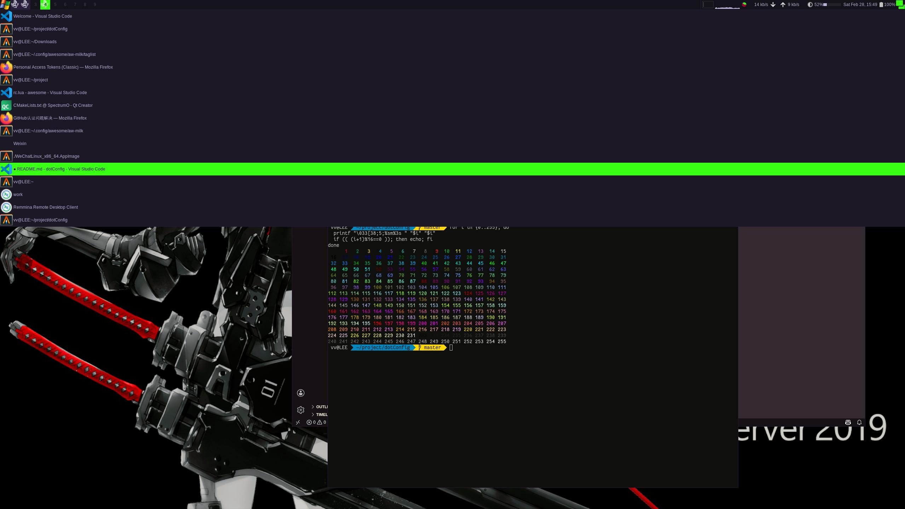

# dotConfig



## font

```bash
fc-cache -fv
```

## alacritty

theme: [Blood Moon](https://github.com/dguo/blood-moon)

## awesome

use [awesomewm-widgets](https://github.com/streetturtle/awesome-wm-widgets)

## rofi

theme: DarkBlue

